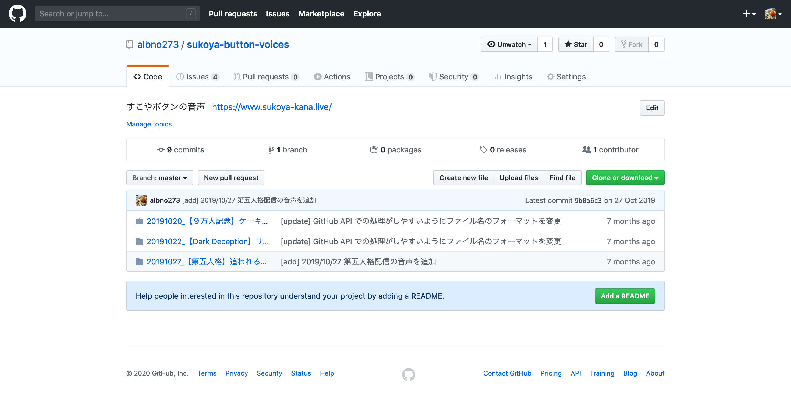
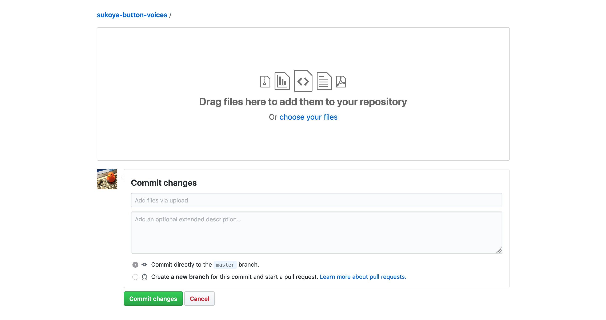

# sukoya-button-voices

## なにこれ

[すこやボタン](https://www.sukoya-kana.live)の[リポジトリ](https://github.com/albno273/sukoya-button)のうち、音声ファイルを別管理にしたリポジトリ。
**音声切り抜きに協力してくださる方大募集中です！！**

## How to add voices

1. ボタンにしたい音声を切り抜いて MP3 として保存する
    - アーカイブでの再生位置が h[時間]mm[分]ss[秒] の場合、ファイル名は `h_mm_ss_音声内容.mp3` とする
1. 音声ファイルをアーカイブごとにフォルダにまとめる
    - 配信日が YYYY[年]MM[月]DD[日] の場合、フォルダ名は `YYYYMMDD_配信タイトル` とする
1. リポジトリのトップ画面中央右の "Upload files" をクリック  
   
1. 画面中央のエリアにフォルダをドラッグアンドドロップし、その下に更新内容(あれば説明も)を記載して、"Commit Changes" をクリック
   
1. 完了！

## License

音声の著作権は[「にじさんじ所属 公式バーチャルライバー 健屋花那」](https://www.youtube.com/channel/UC8C1LLhBhf_E2IBPLSDJXlQ)に帰属します。  
